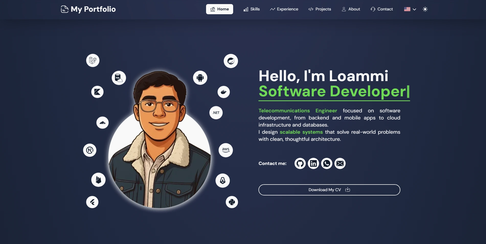
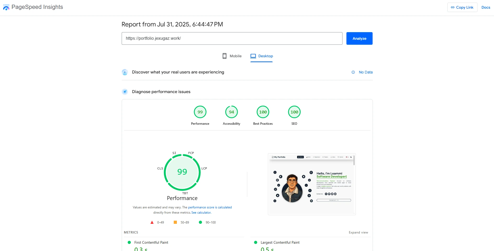

# 🌐 Portfolio Website

This is a personal portfolio site built with modern web technologies to showcase professional experience, projects, and skills in a clean, responsive, and accessible way.

🌐 Live site: https://portfolio.jexugaz.work/

## 📸 Preview



### 🖼 Final Screenshot

This is the final rendered version of the site during performance auditing:



## 🔧 Tech Stack

- **Astro** – Static site generator
- **React** – Interactive UI components (e.g. tab switcher)
- **TypeScript** – Type-safe development
- **JavaScript (Vanilla)** – For dynamic behavior (e.g. theme toggling)
- **Tailwind CSS** – Utility-first styling
- **Vite** – Lightning-fast development bundler
- **GitHub Actions** – CI/CD for automated deployment
- **GitHub Pages** – Hosting platform

## 🌍 Features

- 🔁 **i18n (internationalization)**: Supports both **English** and **Spanish** using Astro’s i18n integration
- 🌗 **Dark/Light mode toggle** with system preference detection and `localStorage` persistence
- 🧭 **Responsive navigation** for desktop and mobile
- 📁 Organized folder structure following best practices
- 📦 Modular and reusable UI components
- 🌐 Deployed via **GitHub Actions** with configuration for **GitHub Pages**

## 📁 Project Structure

```bash
src/
├── assets/ # Images and media
├── components/ # UI components (About, Projects, Navbar, etc.)
├── data/ # Content and static configuration
├── i18n/ # Internationalization logic
├── layouts/ # Base layout
├── pages/ # Route-based content
├── react/ # React components
├── styles/ # Global styles (CSS variables, fonts)
├── types/ # TypeScript interfaces
```

## 🚀 Getting Started

1. **Clone the repo**

   ```bash
   https://github.com/JexUgaz/my-portfolio.git
   cd my-portfolio
   ```

2. **Install dependencies**

   ```bash
   npm install
   ```

3. **Run development server**

   ```bash
   npm run dev
   ```

4. **Build for production**

   ```bash
   npm run build
   ```

5. **Preview production**

   ```bash
   npm run preview
   ```

## 🚚 Deployment

This project is deployed via GitHub Actions and hosted on GitHub Pages. The workflow builds the site and pushes the output in the `dist/` folder to the appropriate branch.

## ✍️ Customization

- Edit content in `src/data` and `src/components`

- Add languages via `i18n/`

- Adjust theme or colors via CSS variables in `styles/global.css`

- Extend components or animations as needed

---

## 📄 License

This project is open source and available under the [MIT License](LICENSE).

---

## 📬 Contact

Made by **Loammi Ugaz** — [LinkedIn](https://www.linkedin.com/in/lugazmlink/) • [GitHub](https://github.com/JexUgaz/)
