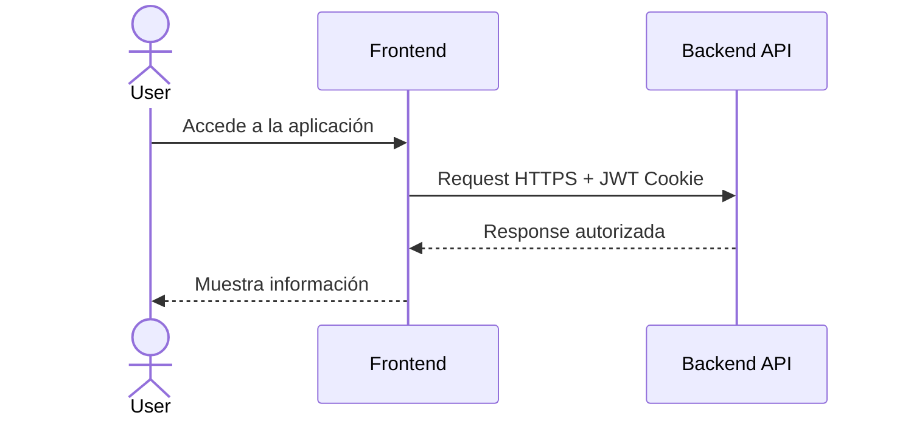
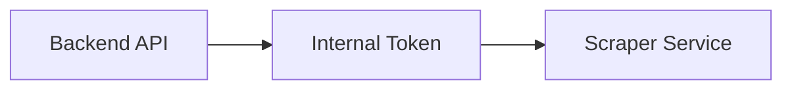
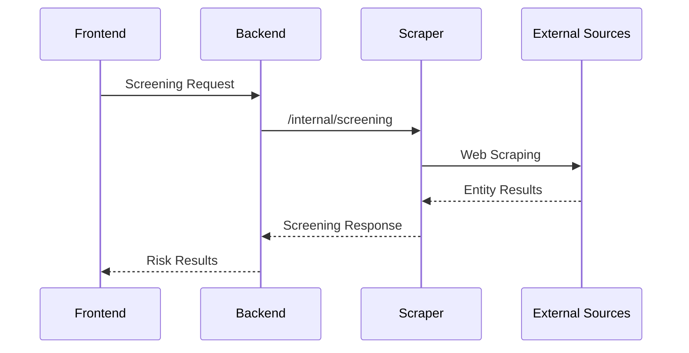

# Solution Architecture

The platform consists of three independent services:

- Frontend SPA: User interaction layer.
- Backend API: Business core and orchestration.
- Risk Entity Scraper: Specialized service for external information extraction.

# Service Communication

## Frontend -> Backend

Communication between the web application and the API is carried out via HTTPS.

Key features:

- Access is restricted through CORS configured with allowed domains.
- Authentication uses JWT stored in HttpOnly and Secure cookies.
- Communication is configured to run exclusively over HTTPS.

[Sequence: User -> Access application -> Frontend -> HTTPS Request + JWT Cookie -> Backend API -> Authorized Response -> Frontend -> Display information -> User]

---

## Backend -> Risk Entity Scraper

Internal communication between the Backend and the Scraper is protected through service authentication.

This ensures that:

- The scraper is not publicly exposed.
- Only authorized services can execute searches.
- Extraction logic remains decoupled from the main backend.

## Screening Flow

The backend does not perform scraping directly.

Extraction responsibility is isolated in an independent service.

The flow is:

1. User executes a screening search.
2. Frontend sends the request to the backend.
3. Backend validates the request and consumes the scraper service.
4. The scraper executes the search against external sources.
5. Results return to the backend and finally to the user.

