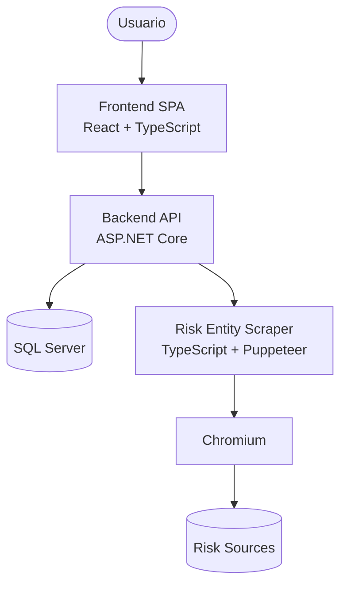
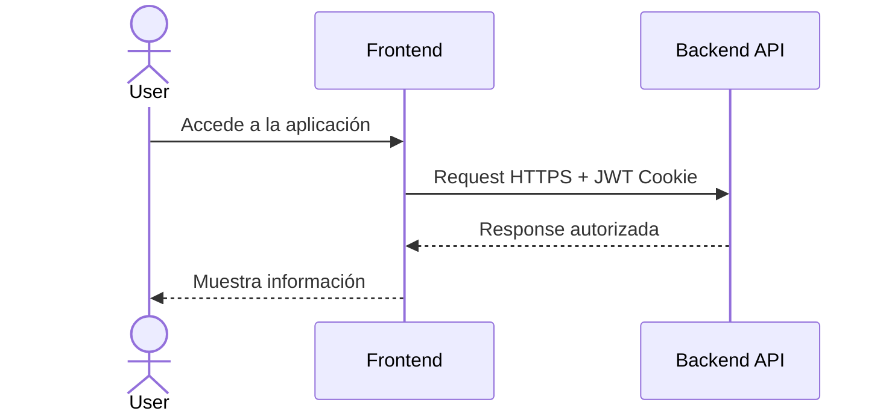
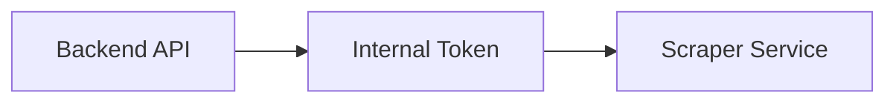
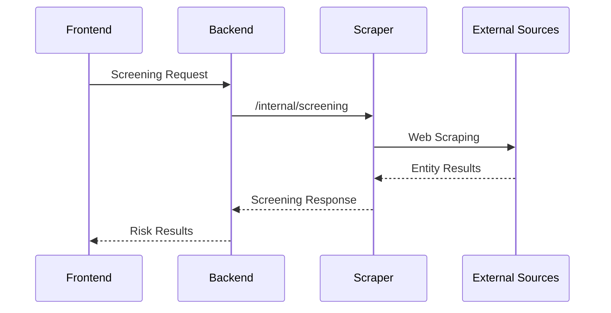

# Arquitectura de la solución

La plataforma está compuesta por tres servicios independientes:

- **Frontend SPA:** capa de interacción con el usuario.
- **Backend API:** núcleo de negocio y orquestación.
- **Risk Entity Scraper:** servicio especializado en extracción de información externa.

# Comunicación entre servicios

## Frontend → Backend

La comunicación entre la aplicación web y la API se realiza mediante HTTPS.

Características principales:

- El acceso está restringido mediante **CORS** configurado por dominios permitidos.
- La autenticación utiliza **JWT almacenado en cookies HttpOnly y Secure**.
- La comunicación está preparada para ejecutarse únicamente sobre HTTPS.

---

## Backend → Risk Entity Scraper

## La comunicación interna entre Backend y Scraper está protegida mediante autenticación de servicio.

Esto permite que:

- El scraper no sea expuesto públicamente.
- Solo servicios autorizados puedan ejecutar búsquedas.
- La lógica de extracción permanezca desacoplada del backend principal.

## Flujo de screening

El backend no realiza scraping directamente.

La responsabilidad de extracción está aislada en un servicio independiente.

El flujo es:

1. Usuario ejecuta una búsqueda de screening.
2. Frontend envía la solicitud al backend.
3. Backend valida la solicitud y consume el servicio scraper.
4. El scraper ejecuta la búsqueda en fuentes externas.
5. Los resultados retornan al backend y finalmente al usuario.

