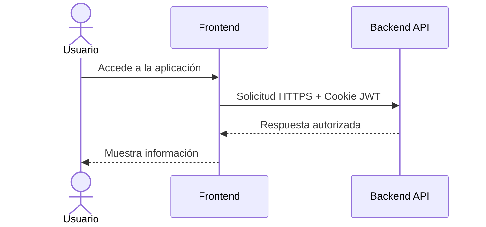
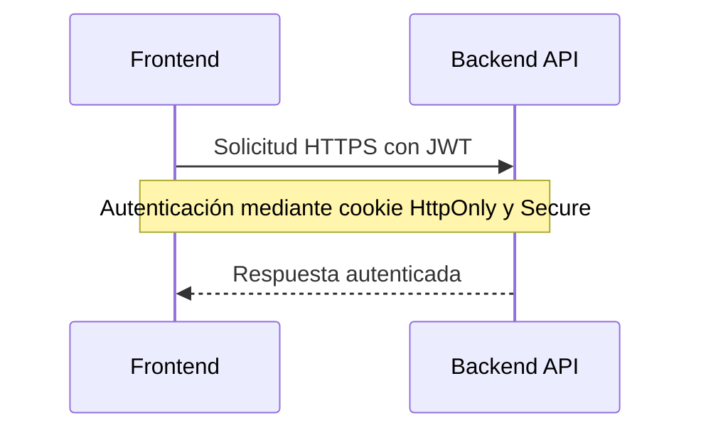
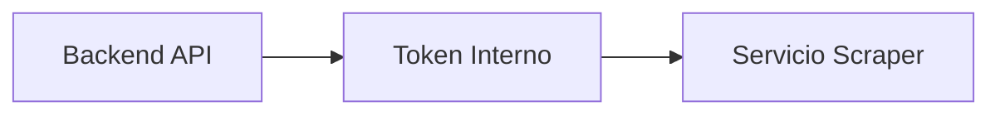
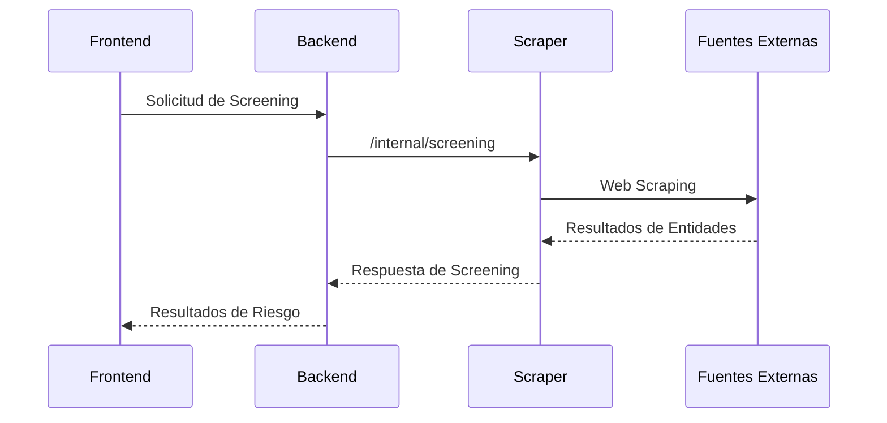

# Arquitectura de la Solución

La plataforma está compuesta por tres servicios independientes:

- Frontend SPA: Capa de interacción con el usuario.
- Backend API: Núcleo de negocio y orquestación.
- Risk Entity Scraper: Servicio especializado para la extracción de información desde fuentes externas.

# Comunicación entre Servicios

## Frontend -> Backend

La comunicación entre la aplicación web y la API se realiza mediante HTTPS.

Características principales:

- El acceso está restringido mediante CORS configurado con dominios permitidos.
- La autenticación utiliza JWT almacenado en cookies HttpOnly y Secure.
- La comunicación está configurada para ejecutarse exclusivamente sobre HTTPS.

---

## Backend -> Risk Entity Scraper

La comunicación interna entre el Backend y el Scraper está protegida mediante autenticación entre servicios.

Esto garantiza que:

- El scraper no está expuesto públicamente.
- Solo los servicios autorizados pueden ejecutar búsquedas.
- La lógica de extracción permanece desacoplada del backend principal.

## Flujo de Screening

El backend no realiza scraping directamente.

La responsabilidad de extracción está aislada en un servicio independiente.

El flujo es el siguiente:

1. El usuario ejecuta una búsqueda de screening.
2. El Frontend envía la solicitud al Backend.
3. El Backend valida la solicitud y consume el servicio Scraper.
4. El Scraper ejecuta la búsqueda contra fuentes externas.
5. Los resultados regresan al Backend y finalmente al usuario.

